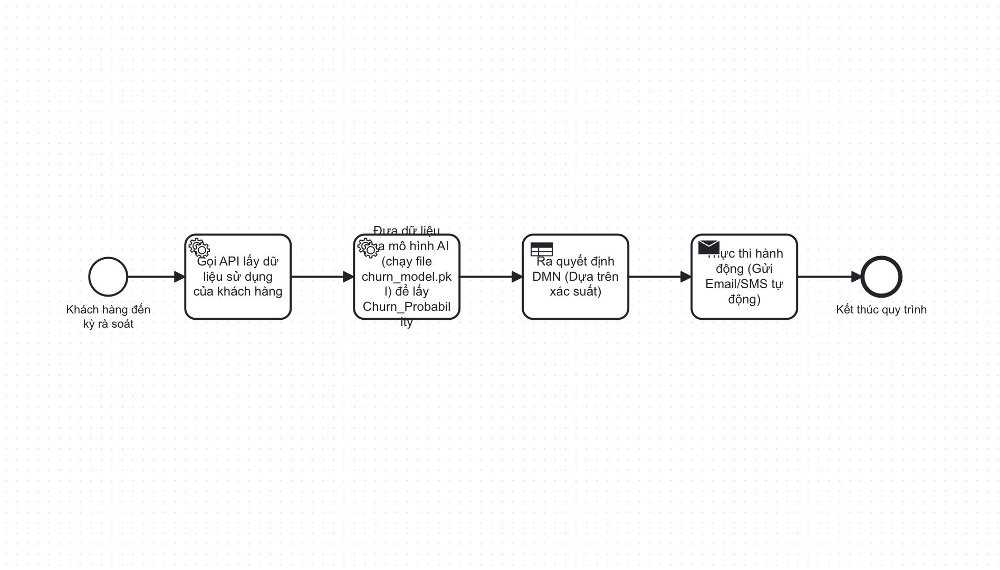
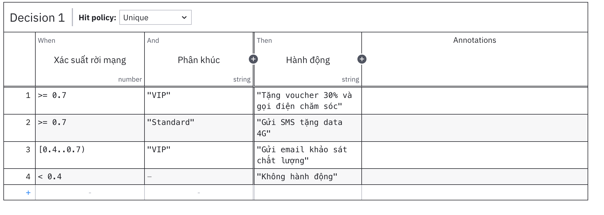

# Automated Customer Churn Prevention Engine


*(Automated Business Process Flow via BPMN)*


*(Automated Decision Engine via DMN based on Churn Probability)*

---

## Business Problem
In the telecommunications industry, acquiring a new customer is significantly more expensive than retaining an existing one. Businesses typically face two major hurdles:
1. **Reactive Approach:** Customer service interventions often occur only when the customer has already initiated the cancellation process, at which point retention is highly unlikely.
2. **Inefficient Budget Allocation:** Distributing promotional vouchers uniformly to all customers—including those with no intention of leaving or those with low profit margins—results in significant marketing budget waste.

## Technical Solution & Machine Learning Pipeline
To address these challenges, this project leverages a comprehensive Machine Learning Pipeline (`01_Churn_Prediction.ipynb`) to proactively assess customer health. Instead of a simple binary prediction, the model is meticulously calibrated to output a continuous **Churn Probability** and operates under strict data science methodologies.

### Pipeline Architecture
1. **Exploratory Data Analysis (EDA):** Deep dive into the Telco dataset to uncover churn drivers, visualizing the distributions of numerical features and key categorical services.
2. **Feature Engineering & Preprocessing:** 
   - Imputing missing values using logical business assumptions (e.g., using initial `MonthlyCharges` for missing `TotalCharges`).
   - Constructing strong behavioral indicators such as `NumServices`, `AutoPay`, and `HighRisk` groupings, moving away from redundant continuous variables.
   - Employing One-Hot Encoding and rigorous Stratified Data Splitting to maintain population distributions.
3. **Addressing Class Imbalance:** Rather than relying on default accuracy metrics (which are misleading with imbalanced churn data), the pipeline evaluates three distinct balancing strategies (Baseline, Scale Weighting, and SMOTE) via 5-Fold Cross-Validation, specifically targeting the **F1-Score**.
4. **Hyperparameter Tuning & Threshold Optimization:**
   - Hyperparameters are tuned via `RandomizedSearchCV` strictly maximizing the F1-Score.
   - The decision threshold is mathematically optimized using **Out-Of-Fold (OOF)** predictions to completely eliminate test set leakage, securing robust generalizability.
5. **Model Explainability (SHAP):** Integration with SHAP provides instance-level transparency, allowing business units to understand the precise features driving an individual's churn risk, enabling highly personalized retention campaigns.

## Business Automation with Camunda
Predictive probability yields business value only when integrated into operational workflows. This project utilizes **Camunda (BPMN & DMN)** to fully automate the decision-making pipeline, ensuring zero-touch operations.

- **DMN (Decision Model and Notation):** Functions as the business logic engine. It evaluates the AI-generated Churn Probability against predefined business rules to output concrete retention actions. For instance, high-risk profiles may trigger immediate discount vouchers or direct account manager interventions, whereas lower-risk profiles might receive automated SMS engagement.
- **BPMN (Business Process Model and Notation):** Orchestrates the end-to-end data flow. It manages the pipeline sequence from retrieving customer data, requesting AI prediction inferences, passing the resultant probability to the DMN engine, and ultimately executing the prescribed retention action via external service tasks.

## Expected Outcomes
- **Increased Retention Rate:** Ensures precise, targeted interventions occur proactively.
- **Cost Optimization:** Strategically restricts promotional budgets to high-value customers who are demonstrably at risk.
- **Operational Efficiency:** The entire retention pipeline operates autonomously, significantly reducing manual overhead for Customer Success teams and minimizing intervention latency.

---
## Tech Stack & Tools
- **Machine Learning & Data Processing:** Python, scikit-learn, XGBoost, imbalanced-learn, SHAP, Pandas, NumPy, Joblib
- **Environment:** Jupyter Notebook
- **Business Process Automation:** Camunda Modeler, BPMN 2.0, DMN 1.3

---
## Repository Structure
- `01_Churn_Prediction.ipynb`: The core analytical notebook encompassing the end-to-end machine learning pipeline from EDA to threshold optimization and SHAP explainability.
- `churn_model.pkl` / `churn_metadata.pkl`: Serialized model artifacts containing the trained XGBoost algorithm, optimized decision threshold, and feature schema required for production inference.
- `/camunda_models/`: Directory housing the BPMN and DMN design schemas and visual diagrams.
- `/data/`: Raw dataset directory.
- `main.py`: Simulation script demonstrating the integration flow between AI Inference, DMN Decisioning, and Execution.

## Execution Instructions
1. Install the required dependencies:
   ```bash
   pip install pandas numpy joblib scikit-learn xgboost imbalanced-learn shap matplotlib seaborn
   ```
2. Execute the inference simulation script:
   ```bash
   python main.py
   ```
3. Monitor the console output to observe the sequential AI analysis and automated DMN decisions.
